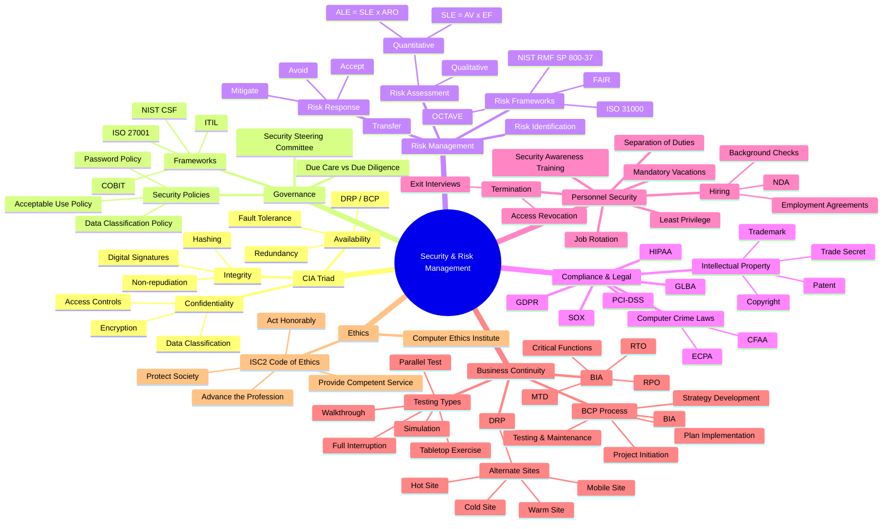

# Domain 1 — Security and Risk Management: Mind Map

```mermaid
mindmap
  root((Security & Risk Management))
    CIA Triad
      Confidentiality
        Data Classification
        Encryption
        Access Controls
      Integrity
        Hashing
        Digital Signatures
        Non-repudiation
      Availability
        Redundancy
        Fault Tolerance
        DRP / BCP
    Governance
      Security Policies
        Acceptable Use Policy
        Data Classification Policy
        Password Policy
      Frameworks
        COBIT
        ITIL
        ISO 27001
        NIST CSF
      Due Care vs Due Diligence
      Security Steering Committee
    Risk Management
      Risk Identification
      Risk Assessment
        Qualitative
        Quantitative
          ALE = SLE x ARO
          SLE = AV x EF
      Risk Response
        Accept
        Avoid
        Transfer
        Mitigate
      Risk Frameworks
        NIST RMF SP 800-37
        ISO 31000
        OCTAVE
        FAIR
    Compliance & Legal
      GDPR
      HIPAA
      PCI-DSS
      SOX
      GLBA
      Computer Crime Laws
        CFAA
        ECPA
      Intellectual Property
        Copyright
        Trademark
        Patent
        Trade Secret
    Personnel Security
      Hiring
        Background Checks
        Employment Agreements
        NDA
      Termination
        Exit Interviews
        Access Revocation
      Security Awareness Training
      Separation of Duties
      Least Privilege
      Mandatory Vacations
      Job Rotation
    Business Continuity
      BCP Process
        Project Initiation
        BIA
        Strategy Development
        Plan Implementation
        Testing & Maintenance
      BIA
        Critical Functions
        MTD
        RTO
        RPO
      DRP
        Alternate Sites
          Hot Site
          Warm Site
          Cold Site
          Mobile Site
      Testing Types
        Tabletop Exercise
        Walkthrough
        Simulation
        Parallel Test
        Full Interruption
    Ethics
      ISC2 Code of Ethics
        Protect Society
        Act Honorably
        Provide Competent Service
        Advance the Profession
      Computer Ethics Institute
```
