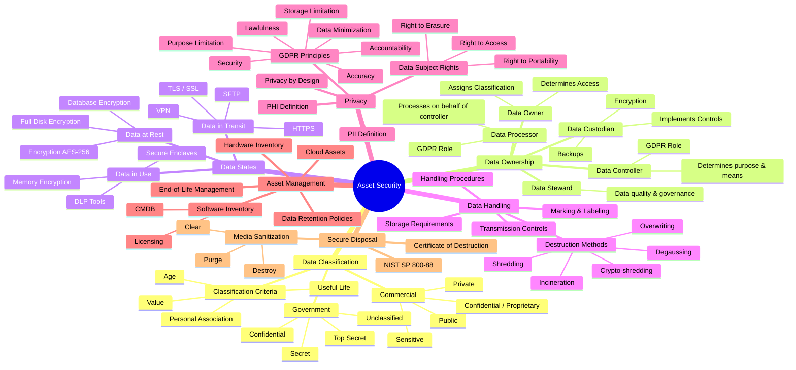

# Domain 2 — Asset Security: Mind Map

```mermaid
mindmap
  root((Asset Security))
    Data Classification
      Government
        Top Secret
        Secret
        Confidential
        Unclassified
      Commercial
        Confidential / Proprietary
        Private
        Sensitive
        Public
      Classification Criteria
        Value
        Age
        Useful Life
        Personal Association
    Data Ownership
      Data Owner
        Assigns Classification
        Determines Access
      Data Custodian
        Implements Controls
        Backups
        Encryption
      Data Processor
        GDPR Role
        Processes on behalf of controller
      Data Controller
        GDPR Role
        Determines purpose & means
      Data Steward
        Data quality & governance
    Data States
      Data at Rest
        Encryption AES-256
        Full Disk Encryption
        Database Encryption
      Data in Transit
        TLS / SSL
        VPN
        HTTPS
        SFTP
      Data in Use
        Memory Encryption
        Secure Enclaves
        DLP Tools
    Data Handling
      Marking & Labeling
      Handling Procedures
      Storage Requirements
      Transmission Controls
      Destruction Methods
        Degaussing
        Shredding
        Overwriting
        Incineration
        Crypto-shredding
    Privacy
      GDPR Principles
        Lawfulness
        Purpose Limitation
        Data Minimization
        Accuracy
        Storage Limitation
        Security
        Accountability
      Privacy by Design
      PII Definition
      PHI Definition
      Data Subject Rights
        Right to Access
        Right to Erasure
        Right to Portability
    Asset Management
      Hardware Inventory
      Software Inventory
        Licensing
        CMDB
      Cloud Assets
      Data Retention Policies
      End-of-Life Management
    Secure Disposal
      Media Sanitization
        Clear
        Purge
        Destroy
      NIST SP 800-88
      Certificate of Destruction
```
