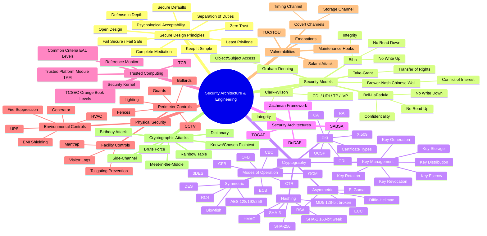

# Domain 3 — Security Architecture and Engineering: Mind Map

```mermaid
mindmap
  root((Security Architecture & Engineering))
    Secure Design Principles
      Least Privilege
      Separation of Duties
      Defense in Depth
      Fail Secure / Fail Safe
      Keep It Simple
      Zero Trust
      Secure Defaults
      Open Design
      Complete Mediation
      Psychological Acceptability
    Security Models
      Bell-LaPadula
        No Read Up
        No Write Down
        Confidentiality
      Biba
        No Read Down
        No Write Up
        Integrity
      Clark-Wilson
        Integrity
        CDI / UDI / TP / IVP
      Brewer-Nash Chinese Wall
        Conflict of Interest
      Graham-Denning
        Object/Subject Access
      Take-Grant
        Transfer of Rights
    Cryptography
      Symmetric
        AES 128/192/256
        3DES
        DES
        Blowfish
        RC4
      Asymmetric
        RSA
        ECC
        Diffie-Hellman
        El Gamal
      Hashing
        MD5 128-bit broken
        SHA-1 160-bit weak
        SHA-256
        SHA-3
        HMAC
      PKI
        CA
        RA
        CRL
        OCSP
        Certificate Types
        X.509
      Modes of Operation
        ECB
        CBC
        CFB
        OFB
        CTR
        GCM
      Key Management
        Key Generation
        Key Distribution
        Key Storage
        Key Rotation
        Key Revocation
        Key Escrow
    Security Architectures
      TOGAF
      Zachman Framework
      SABSA
      DoDAF
    Trusted Computing
      TCB
      Trusted Platform Module TPM
      Reference Monitor
      Security Kernel
      TCSEC Orange Book Levels
      Common Criteria EAL Levels
    Physical Security
      Perimeter Controls
        Fences
        Bollards
        Lighting
        Guards
        CCTV
      Facility Controls
        Mantrap
        Tailgating Prevention
        Visitor Logs
      Environmental Controls
        HVAC
        Fire Suppression
        UPS
        Generator
        EMI Shielding
    Vulnerabilities
      Covert Channels
        Storage Channel
        Timing Channel
      TOC/TOU
      Emanations
      Maintenance Hooks
      Salami Attack
    Cryptographic Attacks
      Brute Force
      Dictionary
      Rainbow Table
      Birthday Attack
      Meet-in-the-Middle
      Side-Channel
      Known/Chosen Plaintext
```
