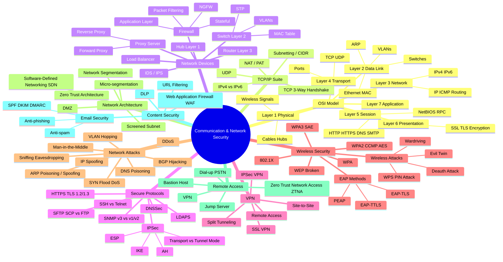

# Domain 4 — Communication and Network Security: Mind Map

```mermaid
mindmap
  root((Communication & Network Security))
    OSI Model
      Layer 7 Application
        HTTP HTTPS DNS SMTP
      Layer 6 Presentation
        SSL TLS Encryption
      Layer 5 Session
        NetBIOS RPC
      Layer 4 Transport
        TCP UDP
        Ports
      Layer 3 Network
        IP ICMP Routing
        IPv4 IPv6
      Layer 2 Data Link
        Ethernet MAC
        ARP
        Switches
        VLANs
      Layer 1 Physical
        Cables Hubs
        Wireless Signals
    TCP/IP Suite
      IPv4 vs IPv6
      TCP 3-Way Handshake
      UDP
      Subnetting / CIDR
      NAT / PAT
    Network Devices
      Hub Layer 1
      Switch Layer 2
        MAC Table
        STP
        VLANs
      Router Layer 3
      Firewall
        Packet Filtering
        Stateful
        Application Layer
        NGFW
      IDS / IPS
      Load Balancer
      Proxy Server
        Forward Proxy
        Reverse Proxy
    Secure Protocols
      HTTPS TLS 1.2/1.3
      SSH vs Telnet
      SFTP SCP vs FTP
      SNMP v3 vs v1/v2
      DNSSec
      LDAPS
      IPSec
        AH
        ESP
        IKE
        Transport vs Tunnel Mode
    VPN
      Site-to-Site
      Remote Access
      SSL VPN
      IPSec VPN
      Split Tunneling
    Wireless Security
      WEP Broken
      WPA
      WPA2 CCMP AES
      WPA3 SAE
      EAP Methods
        EAP-TLS
        PEAP
        EAP-TTLS
      Wireless Attacks
        Evil Twin
        Deauth Attack
        WPS PIN Attack
        Wardriving
      802.1X
    Network Attacks
      Sniffing Eavesdropping
      ARP Poisoning / Spoofing
      DNS Poisoning
      IP Spoofing
      SYN Flood DoS
      DDoS
      Man-in-the-Middle
      VLAN Hopping
      BGP Hijacking
    Network Architecture
      DMZ
      Screened Subnet
      Zero Trust Architecture
      Network Segmentation
      Micro-segmentation
      Software-Defined Networking SDN
    Remote Access
      Dial-up PSTN
      VPN
      Jump Server
      Bastion Host
      Zero Trust Network Access ZTNA
    Content Security
      URL Filtering
      Email Security
        SPF DKIM DMARC
        Anti-spam
        Anti-phishing
      Web Application Firewall WAF
      DLP
```
