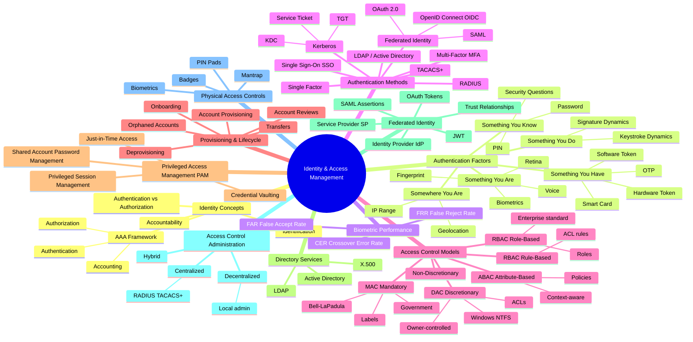

# Domain 5 — Identity and Access Management: Mind Map

```mermaid
mindmap
  root((Identity & Access Management))
    Identity Concepts
      Authentication vs Authorization
      Identification
      Accountability
      AAA Framework
        Authentication
        Authorization
        Accounting
    Authentication Factors
      Something You Know
        Password
        PIN
        Security Questions
      Something You Have
        Smart Card
        Hardware Token
        OTP
        Software Token
      Something You Are
        Biometrics
        Fingerprint
        Retina
        Voice
      Somewhere You Are
        Geolocation
        IP Range
      Something You Do
        Keystroke Dynamics
        Signature Dynamics
    Biometric Performance
      FAR False Accept Rate
      FRR False Reject Rate
      CER Crossover Error Rate
    Authentication Methods
      Single Factor
      Multi-Factor MFA
      Single Sign-On SSO
      Federated Identity
        SAML
        OpenID Connect OIDC
        OAuth 2.0
      Kerberos
        KDC
        TGT
        Service Ticket
      RADIUS
      TACACS+
      LDAP / Active Directory
    Access Control Models
      MAC Mandatory
        Labels
        Bell-LaPadula
        Government
      DAC Discretionary
        Owner-controlled
        ACLs
        Windows NTFS
      RBAC Role-Based
        Roles
        Enterprise standard
      ABAC Attribute-Based
        Policies
        Context-aware
      RBAC Rule-Based
        ACL rules
      Non-Discretionary
    Provisioning & Lifecycle
      Account Provisioning
      Onboarding
      Transfers
      Account Reviews
      Deprovisioning
      Orphaned Accounts
    Privileged Access Management PAM
      Just-in-Time Access
      Privileged Session Management
      Credential Vaulting
      Shared Account Password Management
    Directory Services
      Active Directory
      LDAP
      X.500
    Federated Identity
      Trust Relationships
      Identity Provider IdP
      Service Provider SP
      SAML Assertions
      OAuth Tokens
      JWT
    Access Control Administration
      Centralized
        RADIUS TACACS+
      Decentralized
        Local admin
      Hybrid
    Physical Access Controls
      Badges
      Biometrics
      PIN Pads
      Mantrap
```
