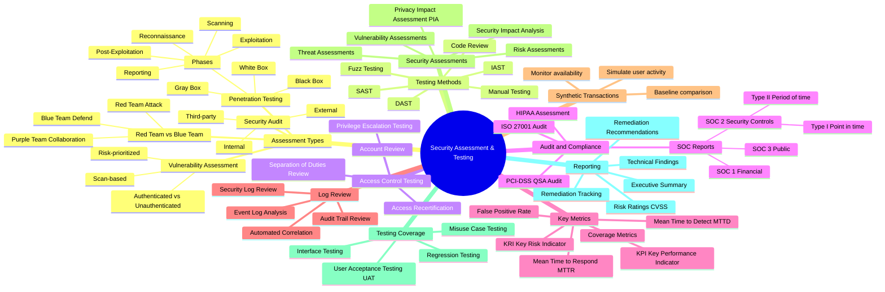

# Domain 6 — Security Assessment and Testing: Mind Map

```mermaid
mindmap
  root((Security Assessment & Testing))
    Assessment Types
      Vulnerability Assessment
        Scan-based
        Risk-prioritized
        Authenticated vs Unauthenticated
      Penetration Testing
        Black Box
        White Box
        Gray Box
        Phases
          Reconnaissance
          Scanning
          Exploitation
          Post-Exploitation
          Reporting
      Red Team vs Blue Team
        Red Team Attack
        Blue Team Defend
        Purple Team Collaboration
      Security Audit
        Internal
        External
        Third-party
    Testing Methods
      SAST
      DAST
      IAST
      Fuzz Testing
      Code Review
      Manual Testing
    Access Control Testing
      Account Review
      Access Recertification
      Privilege Escalation Testing
      Separation of Duties Review
    Audit and Compliance
      SOC Reports
        SOC 1 Financial
        SOC 2 Security Controls
          Type I Point in time
          Type II Period of time
        SOC 3 Public
      ISO 27001 Audit
      PCI-DSS QSA Audit
      HIPAA Assessment
    Key Metrics
      KPI Key Performance Indicator
      KRI Key Risk Indicator
      Mean Time to Detect MTTD
      Mean Time to Respond MTTR
      Coverage Metrics
      False Positive Rate
    Log Review
      Event Log Analysis
      Security Log Review
      Audit Trail Review
      Automated Correlation
    Synthetic Transactions
      Simulate user activity
      Monitor availability
      Baseline comparison
    Security Assessments
      Risk Assessments
      Threat Assessments
      Vulnerability Assessments
      Privacy Impact Assessment PIA
      Security Impact Analysis
    Testing Coverage
      Interface Testing
      Regression Testing
      User Acceptance Testing UAT
      Misuse Case Testing
    Reporting
      Executive Summary
      Technical Findings
      Risk Ratings CVSS
      Remediation Recommendations
      Remediation Tracking
```
