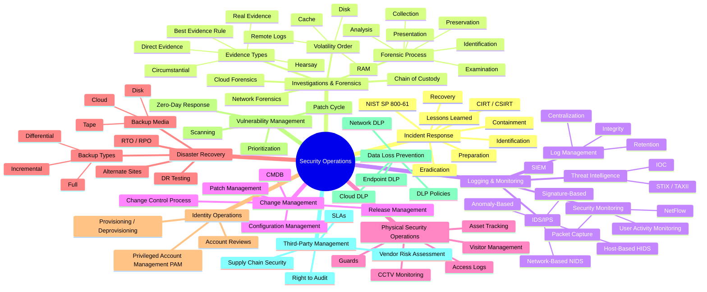

# Domain 7 — Security Operations: Mind Map

```mermaid
mindmap
  root((Security Operations))
    Incident Response
      Preparation
      Identification
      Containment
      Eradication
      Recovery
      Lessons Learned
      NIST SP 800-61
      CIRT / CSIRT
    Investigations & Forensics
      Chain of Custody
      Evidence Types
        Real Evidence
        Direct Evidence
        Circumstantial
        Hearsay
        Best Evidence Rule
      Forensic Process
        Identification
        Preservation
        Collection
        Examination
        Analysis
        Presentation
      Network Forensics
      Cloud Forensics
      Volatility Order
        RAM
        Cache
        Disk
        Remote Logs
    Logging & Monitoring
      SIEM
      Log Management
        Centralization
        Retention
        Integrity
      IDS/IPS
        Signature-Based
        Anomaly-Based
        Host-Based HIDS
        Network-Based NIDS
      Security Monitoring
        NetFlow
        Packet Capture
        User Activity Monitoring
      Threat Intelligence
        IOC
        STIX / TAXII
    Change Management
      Change Control Process
      Configuration Management
      CMDB
      Patch Management
      Release Management
    Physical Security Operations
      Guards
      CCTV Monitoring
      Access Logs
      Visitor Management
      Asset Tracking
    Disaster Recovery
      Backup Types
        Full
        Incremental
        Differential
      Backup Media
        Tape
        Disk
        Cloud
      RTO / RPO
      Alternate Sites
      DR Testing
    Identity Operations
      Provisioning / Deprovisioning
      Privileged Account Management PAM
      Account Reviews
    Vulnerability Management
      Scanning
      Prioritization
      Patch Cycle
      Zero-Day Response
    Data Loss Prevention
      DLP Policies
      Endpoint DLP
      Network DLP
      Cloud DLP
    Third-Party Management
      Vendor Risk Assessment
      SLAs
      Right to Audit
      Supply Chain Security
```
