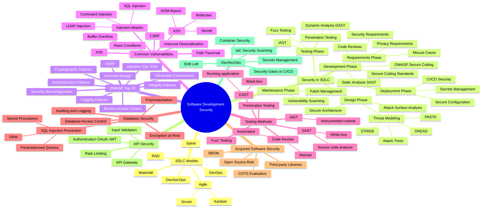

# Domain 8 — Software Development Security: Mind Map

```mermaid
mindmap
  root((Software Development Security))
    SDLC Models
      Waterfall
      Agile
        Scrum
        Kanban
      Spiral
      RAD
      DevOps
      DevSecOps
    Security in SDLC
      Requirements Phase
        Security Requirements
        Misuse Cases
        Privacy Requirements
      Design Phase
        Threat Modeling
          STRIDE
          PASTA
          DREAD
          Attack Trees
        Secure Architecture
        Attack Surface Analysis
      Development Phase
        Secure Coding Standards
        OWASP Secure Coding
        Code Reviews
        Static Analysis SAST
      Testing Phase
        Dynamic Analysis DAST
        Penetration Testing
        Fuzz Testing
        IAST
      Deployment Phase
        Secure Configuration
        Secrets Management
        CI/CD Security
      Maintenance Phase
        Patch Management
        Vulnerability Scanning
    OWASP Top 10
      Broken Access Control
      Cryptographic Failures
      Injection SQL XSS
      Insecure Design
      Security Misconfiguration
      Vulnerable Components
      Authentication Failures
      Integrity Failures
      Logging Failures
      SSRF
    Common Vulnerabilities
      Injection Attacks
        SQL Injection
        Command Injection
        LDAP Injection
      XSS
        Stored
        Reflected
        DOM-Based
      CSRF
      Buffer Overflow
      Race Conditions
      Insecure Deserialization
      Path Traversal
      XXE
    Testing Methods
      SAST
        White-box
        Source code analysis
      DAST
        Black-box
        Running application
      IAST
        Instrumented runtime
      Penetration Testing
      Code Review
        Manual
        Automated
      Fuzz Testing
    Database Security
      SQL Injection Prevention
        Parameterized Queries
        Stored Procedures
        ORM
      Database Access Control
      Encryption at Rest
      Auditing and Logging
      Polyinstantiation
    Acquired Software Security
      COTS Evaluation
      Open Source Risk
      Third-party Libraries
      SBOM
    API Security
      Authentication OAuth JWT
      Rate Limiting
      Input Validation
      API Gateway
    DevSecOps
      Shift Left
      Security Gates in CI/CD
      Container Security
      IaC Security Scanning
      Secrets Management
```
